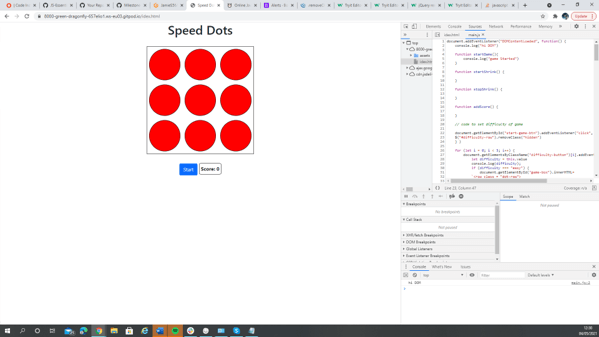
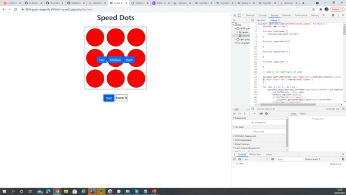
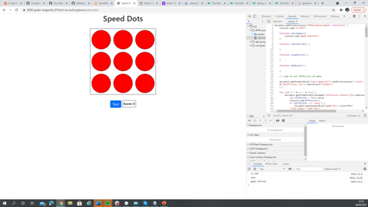
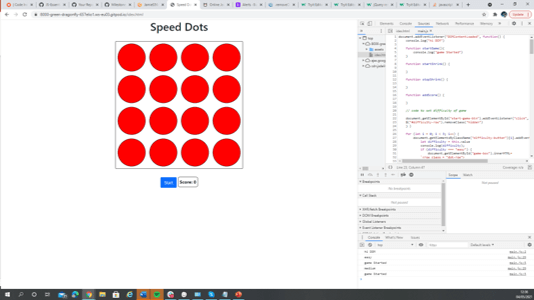
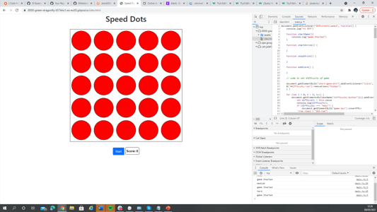
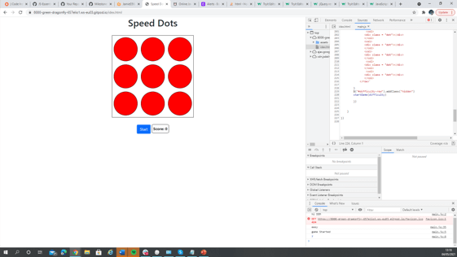
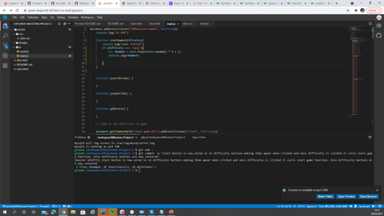
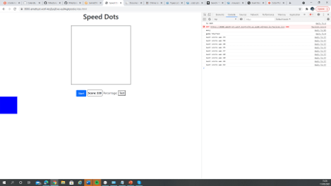
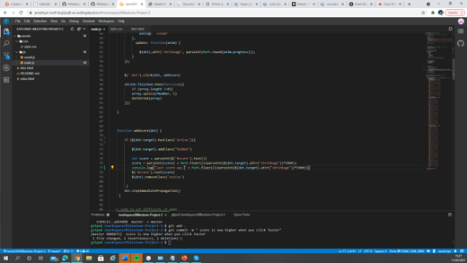

# Speed Dots

## What is Speed Dots

Speed dots is a game that tests the users reaction speed, on the screen you will see a number of dots that when you start the game will start individually shrinking. it is the users task to click on the dots before they dissapear to get as high a score as possible. The faster you click on the dots the higher the score.
---
## UX
Speed dots is for people who want to have fun and test there reaction speed. the target audience is young kids, mainly 6 - 15 year olds, but anyone can play. I think this is a good target audience because kids are more likley to be playing games and have more free time.

### User Stories

* "I want a game thats easy to understand and fun to play."
* "As a dad I want a game thats easy for my kids to play but I can also play and be challenged."
* "I want to be able to contact developers if I have any questions/ concerns about the game."

---
## Wireframes

---
## Features

### Existing features:
Game page - The main page of the website that has access to everything on it.
Rules pop-up - A pop up that explains the rules when you click on the rules button.
Multiple difficulties - There will be multiple difficulties you can choose from, the harder the difficulty, the smaller and more dots there are.
Email dev - a way for the user to contact the dev with any bugs they find or features to suggest.

### future features

game countdown
high score api

---
## Technologies Used
Bootstrap
Jquery
---
## Testing

### Start Button:

Makes the difficulty buttons visible to select difficulty and start game, works well.

### Difficulty buttons:

As you can see they all work changing the number of dots. And also call a function that will start the game when clicked. Shown in the console by printing “game Started”. Also once clicked, all difficulty buttons and hidden and not obstructing the game.

###  Random Number Generator(RNG)

It all works well and selects a random dot each time you run the game.

### Score System:

There were lots of problems linking up the score system.

 The first was getting the process of the progress the animation into the addScore function from the startShrink function. It wouldn’t go into a variable that was accessible in the addScore so instead I added it as an attribute called shrinkage to the dot div. because the div is html I was able to access it through traversing the dom.

Secondly was accessing the classes of the dot. As ‘dot’ was being passed in as an event and not the div object. I managed to target it by using event.target.

Lastly the bubbling effect which meant that the function would fire multiple times the more times you clicked it e.g. 1st click 1 fire, 2nd click, 2 fires not 1st click 1 fire , 2nd click 1 fire. I found a solution online from https://www.sitepoint.com/event-bubbling-javascript/ that said to add dot.stopImediatePropagation() to stop multiple firings.

---
## Deployment

To deploy the website I went onto github and clicked on my project, went to the settings tab and selected pages, then changed the branch from none to master. Then I refreshed the page and the link was live.

To run the code locally you will need to create a git hub acount, then go to my page [jamies56](https://github.com/JamieS56) and click on Milestone Project 2. There will be all the files and you can click on each one to view the code. You can then copy and paste the code into an editor for example git pod and run it yourself.

---
## Credits
https://www.sitepoint.com/event-bubbling-javascript/ where i got the fix for the bubbling problem
---
## Acknowledgements 