# Speed Dots
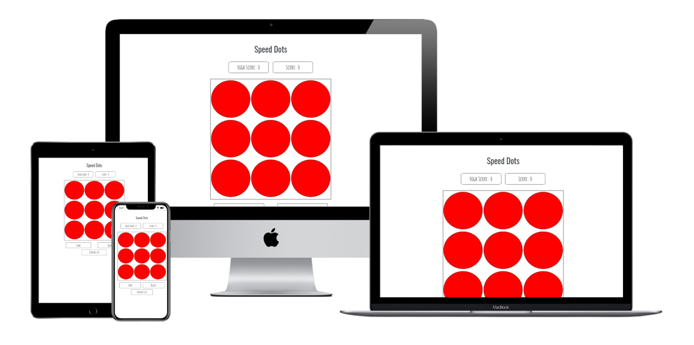
## What is Speed Dots

Speed dots is a game that tests the users reaction speed, on the screen you will see a number of dots that when you start the game will start
 individually shrinking. It is the users task to click on the dots before they disappear to get as high a score as possible. The faster you click
  on the dots the higher the score you get. Overall Speed Dots is meant to be a simplistic, accessible game thats fun.
 
---
## UX
### Target Audience

The target audience is young children, mainly 6 - 15 year olds, but anyone can play. I think this is a good target audience because children are more 
likely to have free time to play games and are more likely to recomend it to their friends and then compete against them to see who gets the highest score.


### Goals

* Easy to learn (simple game mechanics and style).
* Fun and competitive.
* Accessible to a wide range of people across multiple devices.

### User Stories

* "I want a game that's easy to understand and fun to play."
* "As a Dad I want a game thats easy for my kids to play but I can also play and be challenged."
* "I want a game that is competitive."
* "I want to be able to contact someone incase I have any questions or issues with the game."

#### Testing user Stories

* The first user was wondering how easy the game was and how fun it is. 
  * There is a rules button that easily explains the rules and the objective of the game, the game is also really basic, only one action is 
    required (clicking the dots) so it's easy to pick up.
  
    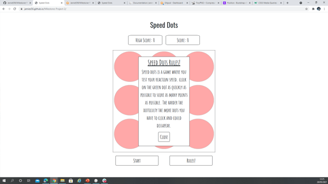

* The second user wanted varying difficulties in the game for himself and his children to play.
  * This is implemented by having multiple difficulties that change the number of dots on screen. Although you can get more points on higher levels it's 
    harder to get the maximum amount of points. 
    
    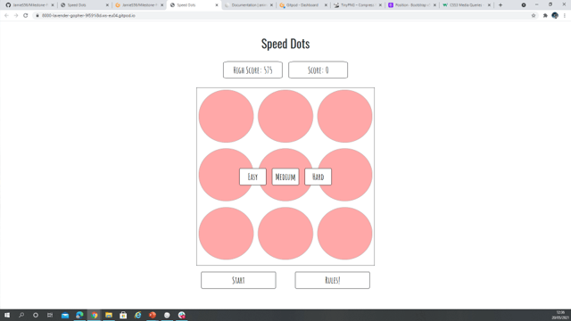

    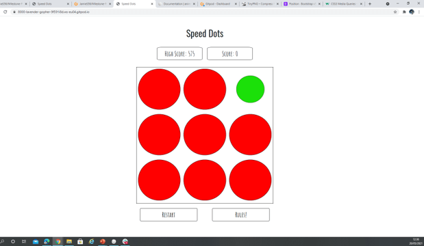

    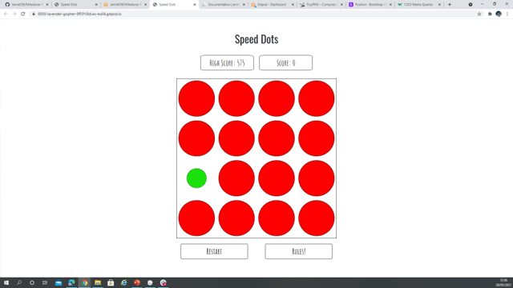

    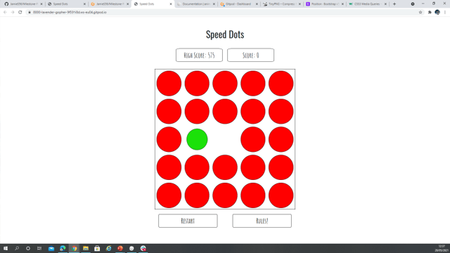

* The third user wants a game that is competitive.
  * The high score feature really adds a competitiveness to the game, because it means players can compare scores with their friends and try and beat each other.

    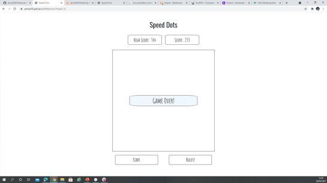

* The fourth user wanted to be able to contact us.
  * I have added a contact button which lets the user fill out the form to send a message to me.
  
  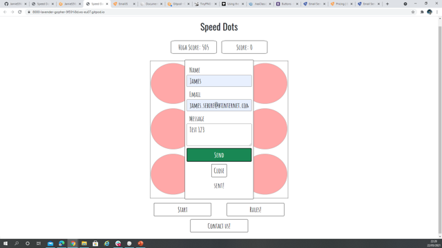

  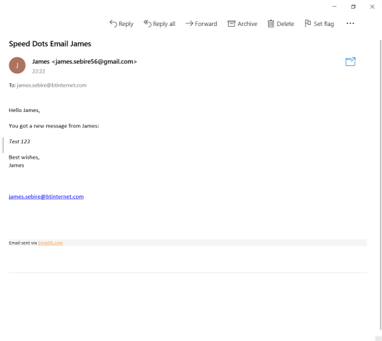

---
### Wireframes

#### Design Choices

I wanted Speed dots to have a really simplistic look, similar to The Impossible Quiz and The Impossible Game, which are both browser games 
I used to play as a child. They were both visually apealing and easy to understand to me as a child. The simplicity of these games made it easy 
to pick up but difficult to master, I want to take those aspects and put them into speed dots. 

I have chosen to have buttons only for the essentials as to not distract from the game, having the actual dots large and in the center of the screen 
because they are the most important thing to the user when playing.

The color scheme for Speed Dots takes inspiration from The Impossible Game. It has very few colors on screen to make the things that matter (the dots) stand 
out to the user which is why I chose red and green as the colors for the dots because they are very easy to tell apart so you can tell which dot is shrinking.

I chose this font because I liked the look of it and it fitted the simplistic style of the game, like if someone had drawn it.

Note: The Contact Us button was added after the wireframes were created but have followed the same design of simplicity, with the button just slotting 
under the rules and start button as it is least vital for gameplay but still easily visible. the actual form is also simple with three input boxes all 
labeled with what should be entered to help the user out.


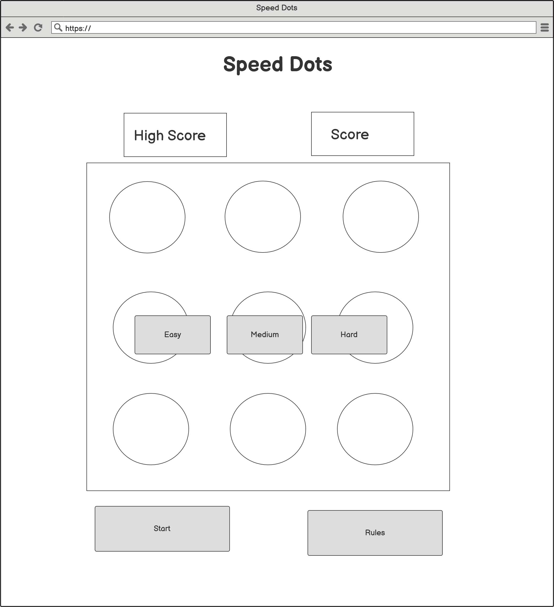

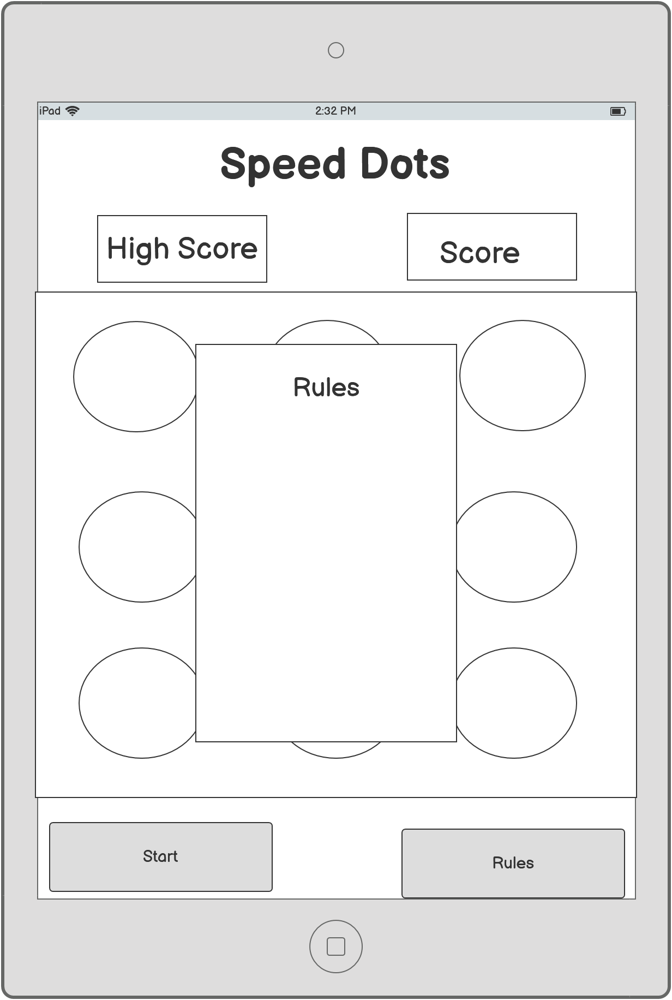

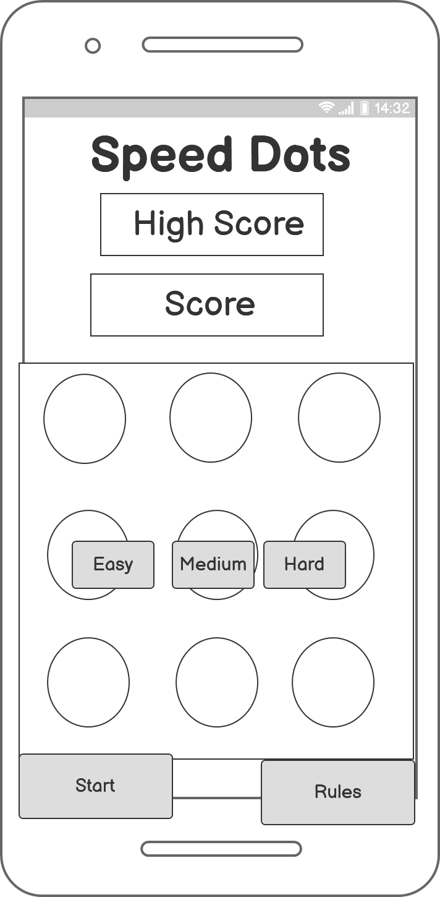

---
## Features

### Existing features:
* Game page - The main page of the website that has access to everything on it.
* Rules pop-up - A pop up that explains the rules when you click on the rules button.
* Multiple difficulties - There will be multiple difficulties you can choose from, the harder the difficulty, the smaller and more dots there are.
* High Score - The users high score will be stored in local memory so it saves in the browser  
* Contact Us - A way for the user to contact the developer with any bugs they find or features to suggest.

### Future features:

* Game countdown - A countdown after difficulty level has been selected to give the user time to get ready.


---
## Technologies Used

* [Bootstrap](https://getbootstrap.com/) - for general css styling.
* [jQuery](https://jquery.com/) - for helping write the js.
* [anime.js](https://animejs.com/) - used to create the shrinking animation.
* [EmailJS](https://www.emailjs.com/) - used for emailing the dev feature.
* [Google Fonts](https://fonts.google.com/) - used the fonts throughout the website.
* [TinyPNG.com](https://tinypng.com/) - used to shrink file size of images used in ReadME file.
* [webFormatter.com](https://webformatter.com/) - used to tidy all code.

---
## Testing

### Start button

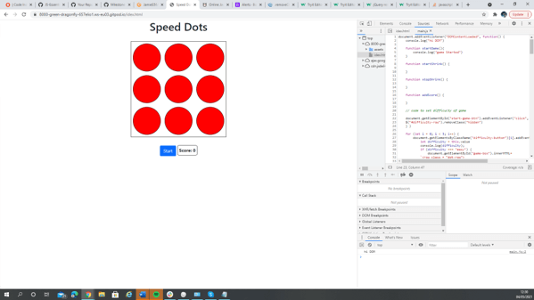

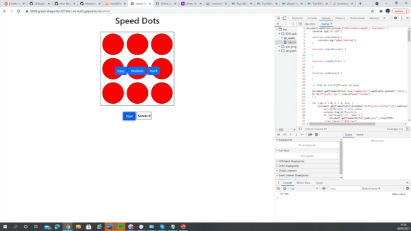

The start button makes the difficulty buttons visible. This allows you to select the difficulty to start the game. The start button's display turns to 'none' as the 
'hidden' feature made replacing the button with the restart button hard to style when 'hidden'. It then returns to a start button again and restart buttons display 
turns to 'none' when game is finished.

#### How to test:

When the page is loaded click on the start button and you will see the difficulty buttons appear. You wil also find that if the rules popup is open, 
and you click start, the rules page will close and vice versa.

### Difficulty buttons:

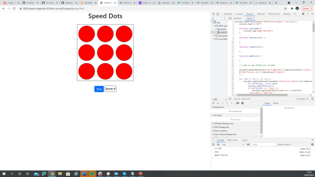

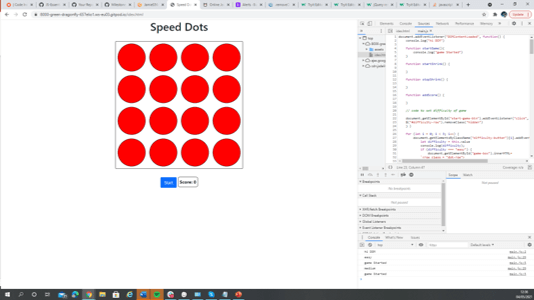

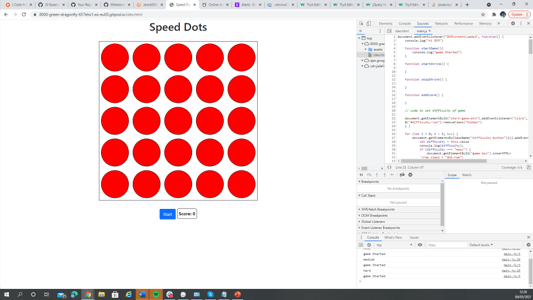

As you can see they all work changing the number of dots that appear, they also call a function that will start the game when clicked as  
shown in the console by printing “game started”. Also once clicked, all difficulty buttons are hidden and not obstructing the game.

#### How to test:

After clicking start click on a dificulty and it will start the game with the corresponding number of dots. 

Difficulty | No. Dots
-----------|----------
Easy | 9
Medium | 16
Hard | 25

###  Random Number Generator(RNG)

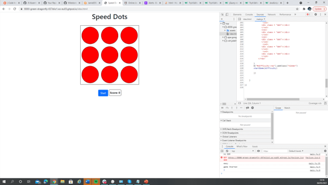

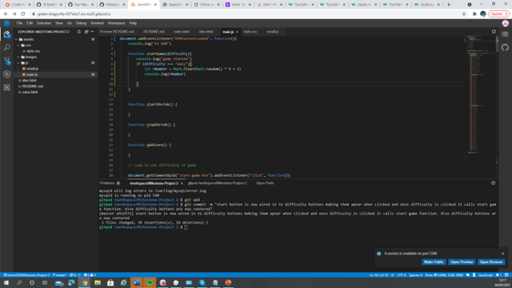

It all works well and selects a random dot each time you run the game.

#### How to test:
Start the game on any difficulty and a random dot will always start shrinking and so will every dot after, it will be different every game.


### Score system:

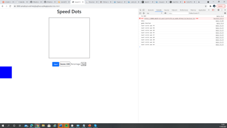

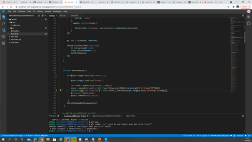

The score system is how the score gets incremented each time you click on the dot, the faster you click on it the more points you get. This then gets shown in the score box.
The score is worked out by taking the animation completion rate provided by the anime.js api and using the equation 1000/completion.

#### Bugs I had:

* The first problem I had was getting the progress of the animation into the addScore function from the startShrink function. 
  It wouldn’t go into a variable that was accessible in the addScore function, so instead I added it as an attribute called 'shrinkage' to the dot div and this made 
  the progress accessible through the DOM.

* Secondly was accessing the classes of the dot. As 'dot' was being passed in as an event and not the div object. I managed to target it by using event.target.

* Lastly the bubbling effect which meant that the function would fire multiple times the more times you clicked it e.g. 1st click 1 fire, 2nd click, 2 fires not 1st click 1 fire , 2nd click 1 fire.

#### Fixes:  

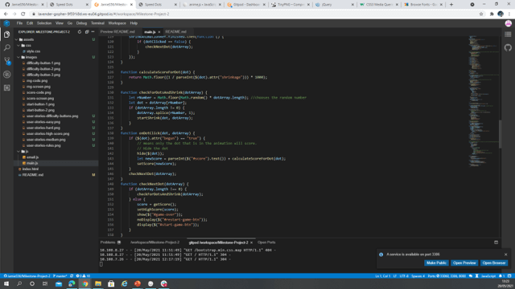

At first I used dot.stopImediatePropagation() to stop the bubbling effect which I got from https://www.sitepoint.com/event-bubbling-javascript/ but then I reworked 
the code so it is now cleaner and there aren't functions inside of functions and this fixed the bubbling effect plus made everything much more managable and 
accessible throughout the js file. This also fixed the problem I was having passing in 'dot' to other functions and is no longer being passed in as an event.

```javascript
    function calculateScoreForDot(dot) {
        return Math.floor((1 / parseInt($(dot).attr("shrinkage"))) * 1000);
    }

    function onDotClick(dot, dotArray) {
        if ($(dot).attr("begun") == "true") {

            hide($(dot));
            let newScore = parseInt($("#score").text()) + calculateScoreForDot(dot);
            setScore(newScore);
        }
        checkNextDot(dotArray);
    }
```

#### How to test:
Play the game and watch the score go up. the longer you wait for the dot to shrink the less points you will get.

### Dot clicking system


The dot should disappear and next dot instantly start shrinking once the original had either disappeared or been clicked.

#### Bugs I had:

The dot would only start the animation once the previous dot had finished its animation.

#### Fixes:

I moved the call for the next dot to start after the click and not after the animation had finished which made the gameplay much smoother and enjoyable.

```javascript
function onDotClick(dot, dotArray) {
    if ($(dot).attr("begun") == "true") {
        hide($(dot));
        let newScore = parseInt($("#score").text()) + calculateScoreForDot(dot);
        setScore(newScore);
    }
    checkNextDot(dotArray);// check next dot is now here instead of after animation has finnished.
}
function checkForDotsAndShrink(dotArray) {
    let rNumber = Math.floor(Math.random() * dotArray.length);
    let dot = dotArray[rNumber];
    if (dotArray.length != 0) {
        dotArray.splice(rNumber, 1);
        startShrink(dot, dotArray);
    }
}
```


#### How to test:

Play the game and click the dots and it will disappear.

### High score system

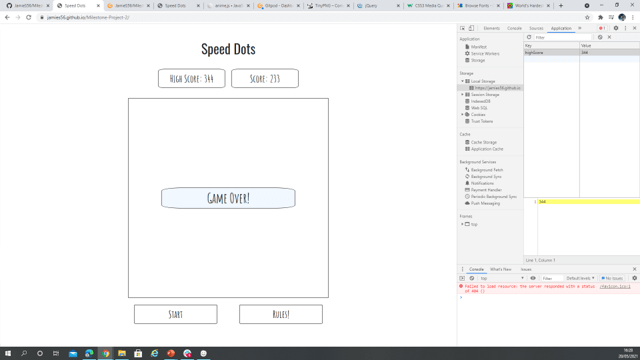

The high score is saved in local memory as shown on the right. The code used tests the availability of local storage and checks before displaying 
the high score incase it isn't available. It works fully on all devices supporting local storage 

#### How to test: 

Get the high score close the tab on your browser and then reopen and your high score will be saved and shown in the high score box.

### Rule button


All it's meant to do is show a pop up on screen of the rules with a close button.

#### How to test:

Click on rules and then close or back on the rules button. You will find that if the difficulty is showing it will disappear when 'rules' is clicked and vice versa.


### Restart button

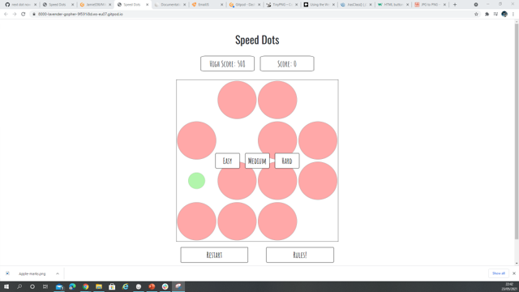

The restart button is meant to stop the game in the background so the user can select a new difficulty or the same one to restart the game.

#### Bugs I had:

I had the problem of the game not stopping when you clicked restart and still running the previous games animations when I had started a new game. 

#### Fixes:

I fixed this by moving the call to start a new dot after a dot had been clicked. Also I used anime.js pause feature to stop the animation.

```javascript
function restart() {
    $("#restart-game-btn").click(function () {
        shrinkAnimationRef.pause();// anime.js pause feature
        $("#start-game-btn").click();
    });
}

function onDotClick(dot, dotArray) {
    if ($(dot).attr("begun") == "true") {
        hide($(dot));
        let newScore = parseInt($("#score").text()) + calculateScoreForDot(dot);
        setScore(newScore);
    }
    checkNextDot(dotArray);// Because it is moved after click it means that it won't get called when the animation ends automatically.
}

    shrinkAnimationRef.finished.then(function () {// This is also a check to continue on to the next dot incas the dot wasn't clickedand will only fire if the dot was not clicked.
        if (dotClicked == false) {
            checkNextDot(dotArray);
        }
    });
}
```

#### How to test:
 
Start the game then choose the difficulty and whilst the game is running, click on the restart button, do this as many times as you like.

### Animation


All the animation is done through [anime.js](https://animejs.com/) API. I decided to use it because creating my own animations seemed far too complex and the 
animations on their website looked really good. All I needed it to do was shrink and stop, so I used the scale property and the pause function. 
I also used the animation progress function as previously mentioned to help get the score. It took a little fiddling to get used to how it worked but overall 
I had no major problems animating the dots.

#### Bugs I had:

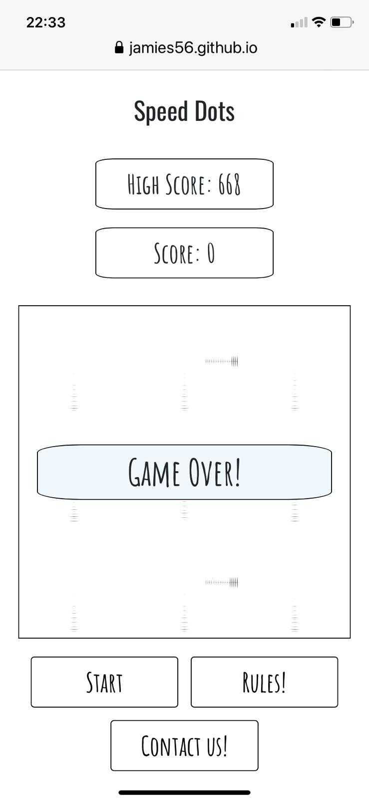

On all Apple products these marks appeared as the dots shrunk. It was random on which dots created lines, it wasn't every dot and also the side on which the marks
 appeared was random. This was only on Apple Mac and iPhones on windows and Android it was fine.

#### Fixes: 

I added an invisible outline to the dot class ``` outline: 1px solid transpaent; ``` because the mark was left by the outer most pixel, I know this because
 when I was testing I removed the border and the marks left where green, the color of the dot. So I just added the outline to make it the most outer pixel. 


#### How to test:

Just play the game and watch the dots shrink, also halfway through the game click the rules or contact us button and you will see the dots pause in the background.

### Emailing form

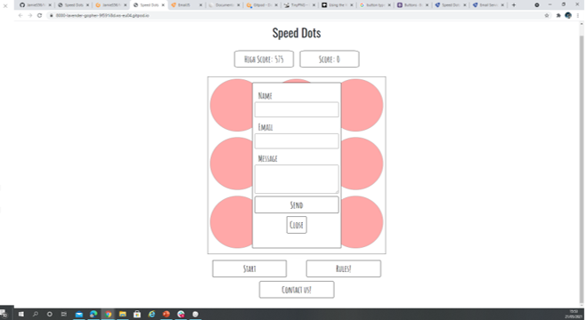

The email form is meant to make it able for the user to send a message to me with comments/ suggestions/ found bugs in the game. 
I have used [EmailJS](https://www.emailjs.com/) API for this as its easy to use and free up to a certain extent.
I had no major issues getting it set up and having an email template in place. As I am using the free version of this API I can only have 200 emails
 a month, which I don't think it will get close too but will cause an error if exceeded. The input boxes also clear when you close the form using any button.

```javascript
 window.onload = function() {
            document.getElementById('contact-form').addEventListener('submit', function(event) {
                event.preventDefault();
                // generate a five digit number for the contact_number variable
                this.contact_number.value = Math.random() * 100000 | 0;
                // these IDs from the previous steps
                emailjs.sendForm('service_w5ucbmd', 'template_oeaclel', this)
                    .then(function() {
                        console.log('SUCCESS!');
                        $('#email-outcome').text('sent!')
                    }, function(error) {
                        console.log('FAILED...', error);
                        $('#email-outcome').text('FAILED...', error);
                    });
            });
        }
```

#### How to test:

Click the contact us button and a form will appear, then fill out the info and a message and click send. If the message has sent correctly 
'sent' will appear underneath to inform you that it has sent. If an error has occured the error will appear there instead. This also is logged to the console.


## Validator testing

* HTML - Absolutley no problems with the HTML validator.

  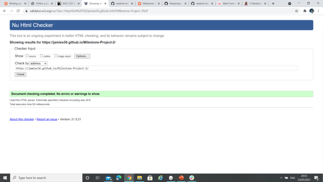

* CSS - All errors and warnings are from bootstrap all my code is fine.

  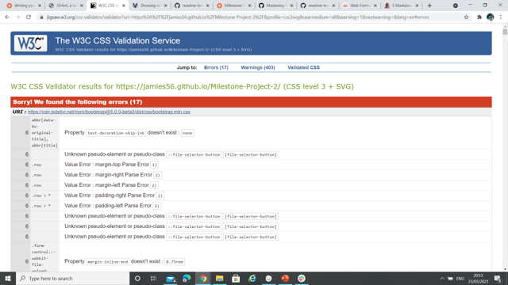

* Java Script - Only warnings are from using jQuery shortcuts, but no errors.

    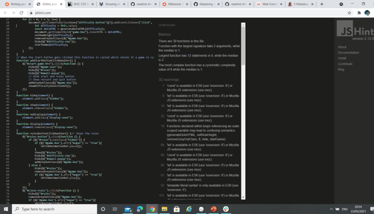

* Light House

   *   Mobile
    
   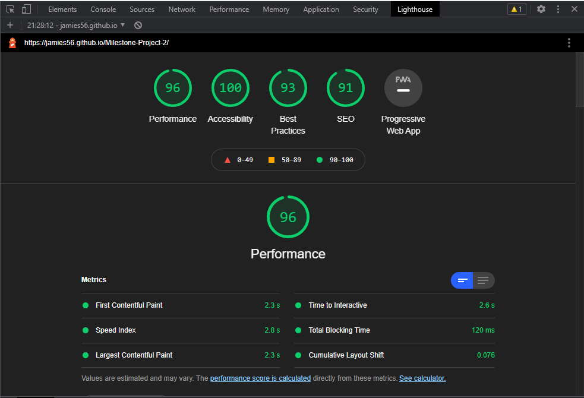 

    *  Desktop
    
    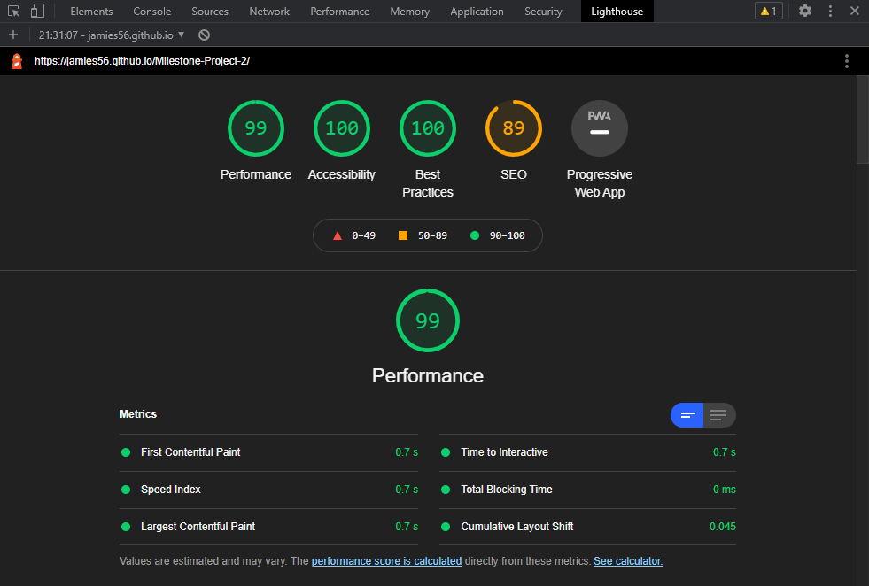 

---

## Deployment

### How to deploy the website:

1. I went to [github](https://github.com/) and logged in.
2. I then clicked on my project, went to the settings tab and selected pages. 
3. I then changed the branch from none to master.
4. Then I refreshed the page and the link was live.

To run the code locally you will need to create a git hub acount, then go to my page [jamies56](https://github.com/JamieS56) and click on Milestone Project 2. 
There will be all the files and you can click on each one to view the code. You can then copy and paste the code into an editor for example git pod and run 
it yourself.

---
## Credits

### High Score code:

* All of this code was taken from https://developer.mozilla.org/en-US/docs/Web/API/Web_Storage_API/Using_the_Web_Storage_API with minor adjustments to
 variable names for context with the game.

```javascript
function storageAvailable(type) {
    var storage;
    try {
        storage = window[type];
        var x = "__storage_test__";
        storage.setItem(x, x);
        storage.removeItem(x);
        return true;
    } catch (e) {
        return (
            e instanceof DOMException &&
            // everything except Firefox
            (e.code === 22 ||
                // Firefox
                e.code === 1014 ||
                // test name field too, because code might not be present
                // everything except Firefox
                e.name === "QuotaExceededError" ||
                // Firefox
                e.name === "NS_ERROR_DOM_QUOTA_REACHED") &&
            // acknowledge QuotaExceededError only if there's something already stored
            storage &&
            storage.length !== 0
        );
    }
}
function checkForHighScore() {
    if (!localStorage.length === 0) {
        setHighScore(0);
    } else {
        let currentHighScore = localStorage.getItem("highScore");
        setHighScore(currentHighScore);
    }
}
```
* Email form code was taken from the [EmailJS](https://www.emailjs.com/) docs

```javascript
 window.onload = function() {
            document.getElementById('contact-form').addEventListener('submit', function(event) {
                event.preventDefault();
                // generate a five digit number for the contact_number variable
                this.contact_number.value = Math.random() * 100000 | 0;
                // these IDs from the previous steps
                emailjs.sendForm('service_w5ucbmd', 'template_oeaclel', this)
                    .then(function() {
                        console.log('SUCCESS!');
                        $('#email-outcome').text('sent!')
                    }, function(error) {
                        console.log('FAILED...', error);
                        $('#email-outcome').text('FAILED...', error);
                    });
            });
        }
```
* Code that is marked as such in the js file is also taken from [anime.js](https://anime.js/) docs.
---
## Acknowledgements 

* [The Impossible Quiz](https://theimpossiblequiz.io/)
* [The Impossible Game](https://www.coolmathgames.com/0-worlds-hardest-game)